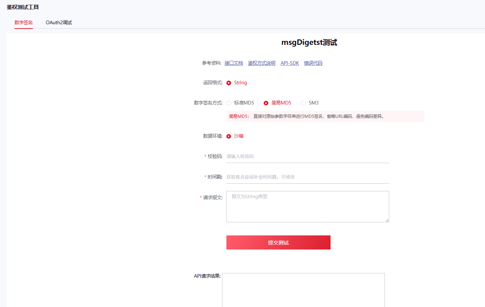

# 数字签名认证（OAuth2 + 简易MD5）

## 1. 概述

适用开发语言：JAVA、Python、C#、Node.js、PHP

### OAuth2 认证说明

- `accessToken` 有效期只有 **2 小时**，需用户维护并定期重新获取令牌，避免接口调用失败。
- 2 小时内调用该接口获取的令牌不变，2 小时后调用返回新令牌。
- [点击进入 OAuth2 鉴权测试工具](https://open.sf-express.com)

---

## 2. OAuth2 认证

### 2.1 请求地址

| 环境 | 地址 |
|------|------|
| 正式环境 | `https://bspgw.sf-express.com/oauth2/accessToken` |
| 沙箱环境 | `https://sfapi-sbox.sf-express.com/oauth2/accessToken` |

### 2.2 通讯协议与报文格式

- 通讯双方采用 HTTP POST。
- 请求头必须添加 `Content-type: application/x-www-form-urlencoded;charset=UTF-8`，字符集 UTF-8。

### 2.3 请求参数

| 参数列表 | 类型 | 是否必传 | 含义 |
|----------|------|----------|------|
| `partnerID` | String(64) | Y | 顾客编码（合作伙伴编码 CustomerCode） |
| `secret` | String(50) | Y | 校验码（合作伙伴密钥 checkWord） |
| `grantType` | String(50) | Y | 申请类型，填 `password` |

### 2.4 响应参数

| 参数名 | 类型 | 是否必填 | 描述 |
|--------|------|----------|------|
| `apiResponseID` | String(40) | Y | 响应ID |
| `apiResultCode` | String(10) | Y | 响应码 |
| `apiErrorMsg` | String(200) | N | 错误描述 |
| `accessToken` | String(100) | Y | 访问令牌 |
| `expiresIn` | Number | Y | 令牌过期时间（秒），默认 7200 秒，过期后需重新获取 |

### 2.5 OAuth2 认证响应码

| 响应码 | 异常信息 | 描述 |
|--------|----------|------|
| A1000 | success | 成功 |
| A1011 | `auth_error:${REASON}` | 认证失败：${原因} |

### 2.6 报文示例

**curl 请求示例**

```bash
curl --request POST \
  --url https://sfapi.sf-express.com/oauth2/accessToken \
  --header 'content-type: application/x-www-form-urlencoded' \
  --data partnerID=yourclientcode \
  --data secret=yourcheckword \
  --data grantType=password
```

**成功报文**

```json
{
    "apiResultCode": "A1000",
    "apiErrorMsg": "success",
    "apiResponseID": "000180E0AC18933F963C52701B18C03F",
    "accessToken": "20D02FC4F63B4A4AA7C9A236EAD5B0A1",
    "expiresIn": 5150
}
```

**失败报文**

```json
{
    "apiResultCode": "A1011",
    "apiErrorMsg": "auth_error:partnerID:test010d_is_not_exist",
    "apiResponseID": "8VYUxU2eL9ZgBXtGXrj",
    "accessToken": null,
    "expiresIn": null
}
```

---

## 3. 简易MD5 签名

### 3.1 概述（相较于标准MD5去除 URLEncoder 过程）

规范顺丰统一接入平台和合作伙伴系统对接过程中 `msgDigest` 字段的生成方式。

### 3.2 通讯协议与报文格式

- 通讯双方采用 HTTP POST。
- 请求头必须添加 `Content-type: application/x-www-form-urlencoded;charset=UTF-8`，字符集 UTF-8。
- 业务数据报文（`msgData`）支持 JSON 格式。
- 接口提交报文为 form 表单形式。

### 3.3 数字签名示例

1. 请求时用 `msgData` 字段表示要发送的 JSON 内容。
2. POST 时用 `msgDigest` 字段签名验证：对 `msgData（业务报文）+ timestamp + checkWord（客户校验码）` 进行 MD5，再转 Base64 字符串。

**详细解释**

假设 JSON 内容为 `{"language":"zh-CN","orderId":"QIAO-20200618-004"}`，时间戳 `12312334453453`，校验码 `fjcg5PGKaNpPSHFAZ4QsCOkV71R3zVci`。

要签名的内容为：

```
{"language":"zh-CN","orderId":"QIAO-20200618-004"}12312334453453fjcg5PGKaNpPSHFAZ4QsCOkV71R3zVci
```

（默认 UTF-8 编码）经 MD5 + Base64 后为 `IIKJtuLVzoFTu4kHI8M8vA==`。

最终发送数据：

```
msgData={"language":"zh-CN","orderId":"QIAO-20200618-004"}&msgDigest=IIKJtuLVzoFTu4kHI8M8vA==
```

> 注意：所有参数通过 URL 编码传送；若内容不正确请检查字符集是否为 UTF-8。

### 3.4 MD5 签名代码示例（Java）

```java
// 客户校验码
String checkWord = "fjcg5PGKaNpPSHFAZ4QsCOkV71R3zVci";

// 时间戳
String timestamp = "12312334453453";

// 业务报文
String msgData = "{\"language\":\"zh-CN\",\"orderId\":\"QIAO-20200618-004\"}";

// 组合加密字符串（注意顺序）
String toVerifyText = msgData + timestamp + checkWord;

// MD5 加密
MessageDigest md5 = MessageDigest.getInstance("MD5");
md5.update(toVerifyText.getBytes("UTF-8"));
byte[] md = md5.digest();

// Base64 生成数字签名
String msgDigest = new String(new BASE64Encoder().encode(md));
```

### 3.5 Postman 工具示例



